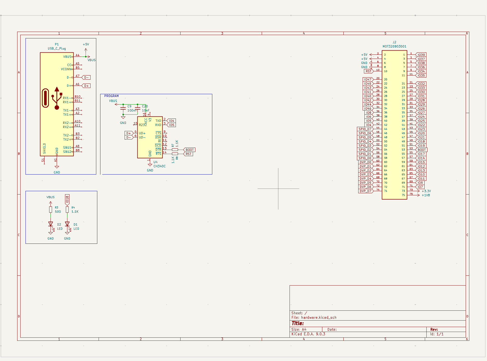
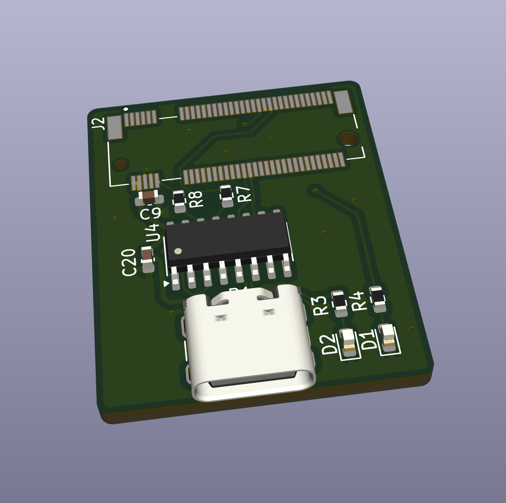

# K210-M1N USB-C Adapter

This repository contains the KiCad 9 project for a compact adapter board that breaks out the **Kendryte K210 M1n** M.2 (Key‑B) module to USB and a minimal set of GPIOs. The board’s USB‑C port is intended primarily for power and UART-based programming through an onboard CH340C USB–serial bridge.

## Hardware Overview

- **Form factor** – Single board implementing the Amphenol MDT320B03001 Key‑B M.2 socket on the top side and a USB‑C receptacle on the edge for direct plug-in to a host.
- **Power** – USB VBUS feeds the CH340C (`+5V`) and is decoupled locally (C9). The board relies on the M1n module’s onboard regulators for `+3.3V` and `+1V8`.
- **USB–UART** – CH340C in SOIC‑16 package with `D+`/`D-` routed to the USB‑C connector and a BOOT/RESET autoprogramming network (R7 to BOOT, R8 to RESET).
- **Status LEDs** – Two LEDs (D1/D2) with current-limiting resistors (R3/R4) monitor `+5V` and `VBUS`.
- **Breakout signals** – Key M.2 pins (IO, SPI0, DVP, etc.) are accessible via the module connector. The schematic uses global labels (`IO4`, `IO5`, …) matching Kendryte’s numbering.

### Board visuals

## Programming Workflow

- The CH340C exposes a UART for flashing firmware onto the K210 module.
- `~RTS` is routed through R8 to the `RST` net (M.2 pad 10), while `~DTR` drives the `BOOT` net (M.2 pad 53) via R7 to automate the boot sequence used by Kendryte tooling.
- Connect the USB‑C port to your host PC, install CH340 drivers if needed, and use Kendryte’s flashing tools over the enumerated serial port.
